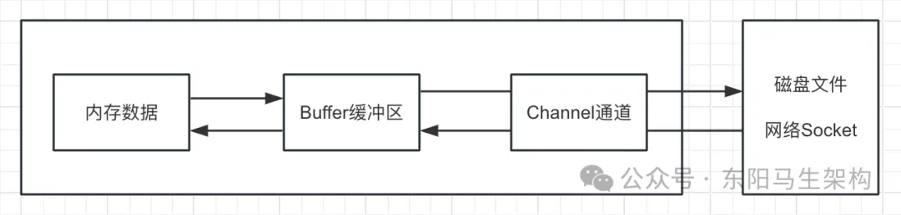
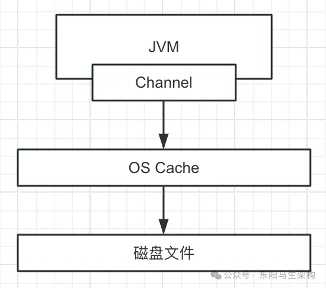

(1)NIO编程中的Channel是什么
Channel是一个通道，网络数据通过Channel读取和写入。通道可以用于读、写或者二者同时进行。
通道与流的区别在于：通道是双向的，流是单向的，一个流必须是InputStream和OutputStream的子类。

分类：用于网络读写的SelectableChannel和用于文件操作的FileChannelSelectableChannel
ServerSocketChannel和SocketChannel都是SelectableChannel的子类。

(2)NIO编程中Buffer和Channel的关系

(3)基于FileChannel将数据写入磁盘文件

(4)利用FileChannel实现顺序写和随机写
[FileChannelDemo.java](FileChannelDemo.java)
[FileChannelDemo2.java](FileChannelDemo2.java)

(5)FileChannel是多线程并发安全的
[FileChannelDemo3.java](FileChannelDemo3.java)

(6)从磁盘文件读取数据到Buffer缓冲区
[FileChannelDemo4.java](FileChannelDemo4.java)

(7)对文件上共享锁限制文件只读
[FileLockDemo1.java](FileLockDemo1.java)
[FileLockDemo2.java](FileLockDemo2.java)

(8)FileChannel的强制刷盘
通过FileChannel写数据到磁盘文件时，不会立即将数据写到磁盘上，而会先将数据写到操作系统自己管理的一个内存区域OS Cache上。
这样处理的好处是可以让磁盘写的性能比较高，但如果此时系统宕机，那么OS Cache里的数据可能就会丢失。

(9)FileChannle的position
FileChannel有一个position的概念，它相当于一个指针，指向了当前文件的某个位置。
读数据是从FileChannel当前的position开始读的，每次刚开始初始化一个FileChannel后，position = 0。
如果要随机读取文件里的某个位置，那么直接设置和定位FileChannel的position，就可以限定从什么位置开始读。

写数据也是从FileChannel当前的position开始写的，刚开始position = 0。
如果直接写，那么可能会覆盖原来的老数据。读了多少字节的数据或写了多少字节的数据，FileChannel的position就会往前移动多少位。

